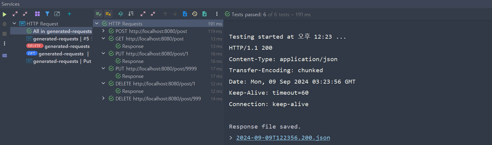

# 취업 리부트 코스 과제

이 프로젝트는 판매 게시글을 관리하는 RESTful API를 구현했다.

Spring Boot를 사용하여 개발되었으며, 기본적인 CRUD (Create, Read, Update, Delete) 기능을 제공한다.

## 기능 목록

1. 판매 게시글 작성
2. 판매 게시글 전체 리스트 조회
3. 판매 게시글 수정
4. 판매 게시글 삭제

## API 엔드포인트

| 기능 | HTTP 메서드 | 엔드포인트 | 요청 본문 | 응답 |
|------|------------|------------|-----------|------|
| 판매 게시글 작성 | POST | /post | 게시글 정보 | 생성된 게시글 정보 |
| 판매 게시글 전체 리스트 조회 | GET | /post | - | 게시글 목록 |
| 판매 게시글 수정 | PUT | /post/{id} | 수정할 게시글 정보 | 수정된 게시글 정보 |
| 판매 게시글 삭제 | DELETE | /post/{id} | - | - |

## 주요 구현 사항

### 1. 엔티티 설계
- `Item` 엔티티: id, username, title, content, price 필드 포함

### 2. DTO (Data Transfer Object) 사용
- `PostItemRequest`: 게시글 작성 및 수정 요청 데이터
- `PostItemResponse`: 게시글 작성 및 수정 응답 데이터
- `GetItemResponse`: 게시글 조회 응답 데이터

### 3. 서비스 레이어 구현
- `ItemService`: 비즈니스 로직 처리
    - create: 게시글 생성
    - getAll: 전체 게시글 조회
    - update: 게시글 수정
    - delete: 게시글 삭제

### 4. 컨트롤러 구현
- `ItemController`: API 엔드포인트 정의
    - RESTful 원칙에 따른 URL 및 HTTP 메서드 매핑
    - 적절한 HTTP 상태 코드 반환

### 5. 예외 처리
- `EntityNotFoundException` 처리: 요청한 리소스가 없을 경우 404 상태 코드 반환
- `@ExceptionHandler`를 사용한 중앙화된 예외 처리

## 테스트 현황

기본적인 기능 구현과 간단한 예외처리가 정상동작함을 확인
